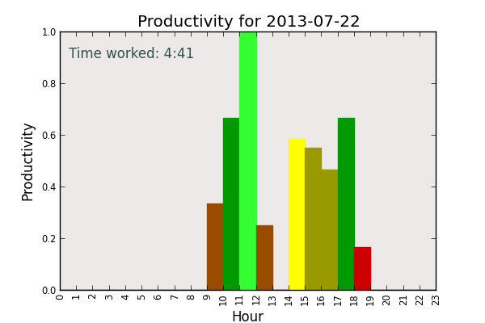

# graph_productivity.py #

Author: Brett Hutley <brett@hutley.net>

This code extracts the log of the timeboxes I've worked on a given day and then creates a bar-chart aggregating the work done each hour, in order to show how my productivity changes during the day.

You need to specify a text file as input using the '-i' command-line option.

The input text file is tab delimited has the format:

    YYYY-MM-DDTHH:MM:SS	YYYY-MM-DDTHH:MM:SS	"Time-box Description"
    
The first two fields are start time and end time respectively.

By default it will create a chart called productivity.png in the current directory. You can specify a different output file using the '-o' command-line option.

This is an example of what the chart looks like:

